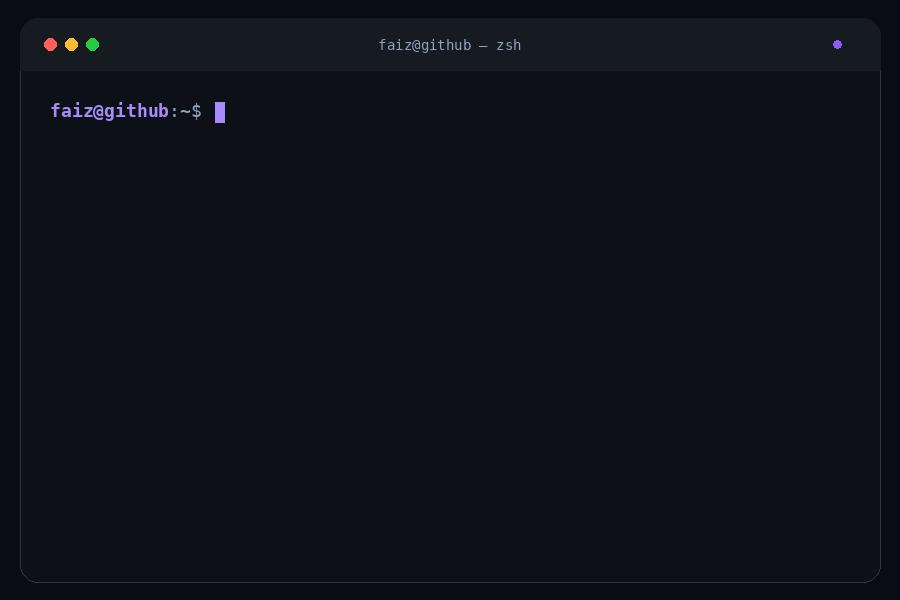

# Hey, I'm Faiz 👋

  
  
  

---

### About Me

CS Honours Co-op student at **Ontario Tech University** · **3.78 GPA · Dean's List**

I build AI systems that are measurable, empirically validated, and actually useful — real-time computer vision pipelines, LLM evaluation frameworks, and multi-agent workflows. I care about makin[...]

---

### 🔨 What I'm Building

<table>
<tr>
<td width="50%" valign="top">

**🕵️ ContentSpy**

> AI Competitor Intelligence Platform

Transcript ingestion → AI video analysis → content-gap detection → script generation.

Currently powering **6+ creator workflows** across a **10-user private beta**.

`Next.js` `FastAPI` `PostgreSQL` `Supabase`

</td>
<td width="50%" valign="top">

**[🎬 Vibe Editor](https://github.com/FeezRM/vibe-editing)**

> Agentic Video Pipeline

Turns raw video into edited output through word-level transcription, LLM-generated edit decisions, and FFmpeg rendering.

A **0.85 confidence gate** filters unreliable AI cuts before they reach the render pipeline.

`Python` `faster-whisper` `OpenCV` `LLM Agents`

</td>
</tr>
<tr>
<td width="50%" valign="top">

**[🧠 FocusFlow](https://github.com/FeezRM/FocusFlow)**

> AI Attention Monitor

Computer-vision pipeline running at **10 FPS with <100ms inference**, backed by a 6-state attention FSM.

In a 50+ participant study:

**~50% less distracted time · ~40% faster refocus**

`Python` `FastAPI` `MediaPipe` `Electron`

</td>
<td width="50%" valign="top">

**[🤖 LLM Research Agent](https://github.com/FeezRM)**

> Multi-Source Discovery Pipeline

Structured research pipeline using deterministic guardrails, schema-constrained outputs, classification, and deduplication.

Normalized **100+ profiles across 7 niches** while reducing manual cleanup by **80%+**.

`Python` `Claude API` `Notion API` `Web Automation`

</td>
</tr>
</table>

---

### 💼 Experience

**Northbridge Insurance** · _Incoming Software Developer Intern_ · Spet – Dec 2026

**MekTek Software Solutions & Engineering** · _Frontend Developer Intern_ · Sept – Dec 2025

- Audited AI-driven platform: identified and resolved **10+ critical security findings** before production
- Built headless CMS with Next.js + WordPress REST APIs → **65% faster** content publishing

---

### 🛠 Tech Stack

**Languages**

**Frameworks & Tools**

**ML & AI**

**Cloud & Infra**

---
